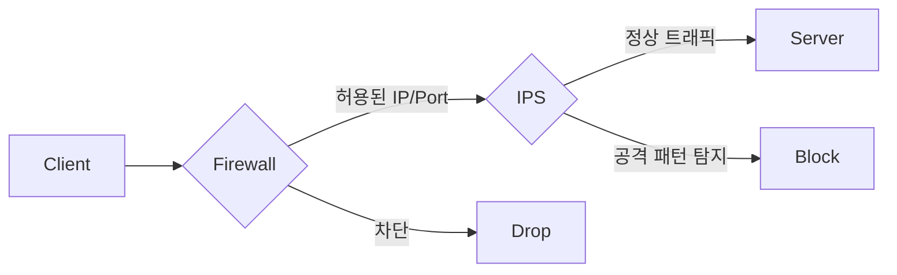
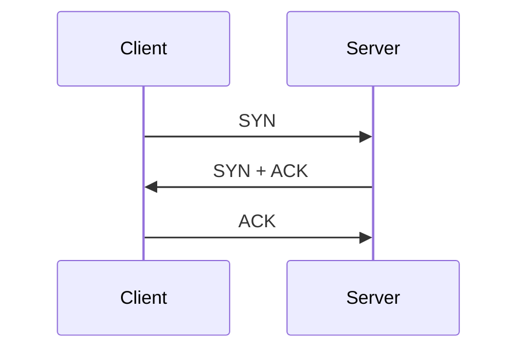

# Astro Starlight 개발 학습노트 Implementation Plan

> **For agentic workers:** REQUIRED SUB-SKILL: Use superpowers:subagent-driven-development (recommended) or superpowers:executing-plans to implement this plan task-by-task. Steps use checkbox (`- [ ]`) syntax for tracking.

**Goal:** Docusaurus 저장소를 한국어 Astro Starlight 학습노트로 교체하고 `main`에서 GitHub Pages에 배포한다.

**Architecture:** Astro 7이 정적 사이트를 생성하고 Starlight가 문서 라우팅·탐색·한국어 UI를 제공한다. `astro-mermaid`가 Markdown Mermaid 블록을 처리하며, Node 내장 테스트가 실제 Astro 빌드와 생성된 HTML을 통해 사용자 가시 계약을 검증한다.

**Tech Stack:** Node.js 22, npm 10, Astro 7.2.0, Starlight 0.41.7, astro-mermaid 2.1.0, Mermaid 11.16.1, GitHub Actions, GitHub Pages

## Global Constraints

- 공개 URL은 정확히 `https://reha-design.github.io`이며 `base`를 설정하지 않는다.
- 기본 브랜치와 배포 트리거는 `main`이다.
- 원본 Docusaurus 커밋 `19be02f`는 `backup/docusaurus-20260808`에 유지한다.
- 사이트 제목은 `레하의 개발 학습노트`이다.
- 루트 locale은 `root`, 문서 언어는 `ko-KR`이며 URL에 `/ko` 접두사를 붙이지 않는다.
- Mermaid integration은 Starlight integration보다 먼저 배치하고 `autoTheme: true`를 사용한다.
- 사이드바 순서는 Network, Security, Database, Infra, Backend이다.
- SVG 파일 경로는 `public/diagrams/`이며 문서 URL은 `/diagrams/<파일명>.svg`이다.
- workflow action은 `actions/checkout@v7`, `withastro/action@v6`, `actions/deploy-pages@v5`를 사용한다.
- 테스트는 소스 문자열이 아니라 실제 Astro 빌드의 종료 코드, 라우트, HTML 및 Mermaid 출력을 검사한다.

---

### Task 1: Astro 런타임과 한국어 홈

**Files:**
- Create: `tests/site-build.test.mjs`
- Create: `package.json`
- Generate: `package-lock.json`
- Create: `astro.config.mjs`
- Create: `src/content.config.ts`
- Create: `src/content/docs/index.mdx`
- Modify: `.gitignore`
- Remove: Docusaurus 런타임과 샘플 콘텐츠

**Interfaces:**
- Consumes: 승인된 설계와 `backup/docusaurus-20260808`
- Produces: `npm test`, `npm run dev`, `npm run build`, `/` Starlight 홈

- [ ] **Step 1: 실제 빌드 결과를 검사하는 실패 테스트를 작성한다**

```js
// tests/site-build.test.mjs
import assert from 'node:assert/strict';
import { existsSync, readFileSync, rmSync } from 'node:fs';
import { join } from 'node:path';
import { spawnSync } from 'node:child_process';
import test from 'node:test';

const dist = join(process.cwd(), 'dist');
rmSync(dist, { recursive: true, force: true });

const npm = process.platform === 'win32' ? 'npm.cmd' : 'npm';
const build = spawnSync(npm, ['run', 'build'], {
  cwd: process.cwd(),
  encoding: 'utf8',
});

assert.equal(build.status, 0, `${build.stdout}\n${build.stderr}`);

test('builds the Korean Starlight home at /', () => {
  const homePath = join(dist, 'index.html');
  assert.equal(existsSync(homePath), true, 'dist/index.html must exist');
  const html = readFileSync(homePath, 'utf8');
  assert.match(html, /<html[^>]+lang="ko-KR"/);
  assert.match(html, /레하의 개발 학습노트/);
  assert.match(html, /Network/);
  assert.match(html, /href="\/" class="site-title/);
});
```

- [ ] **Step 2: 기존 Docusaurus가 Astro 산출물을 만들지 못해 테스트가 실패하는지 확인한다**

Run: `node --test tests/site-build.test.mjs`

Expected: FAIL because the existing project does not create the Astro `dist/index.html` output.

- [ ] **Step 3: 제거 대상이 저장소 내부인지 확인하고 Docusaurus 파일을 정리한다**

```powershell
$repo = (Resolve-Path '.').Path
$targets = @(
  'blog', 'src', 'static', '.docusaurus', 'build',
  'docusaurus.config.js', 'sidebars.js', 'bun.lock',
  'package.json', 'package-lock.json', 'README.md'
)
$resolved = $targets | ForEach-Object { Join-Path $repo $_ }
$resolved | ForEach-Object {
  if (-not $_.StartsWith($repo + [IO.Path]::DirectorySeparatorChar)) { throw "Unsafe target: $_" }
}
$resolved | ForEach-Object {
  if (Test-Path -LiteralPath $_) { Remove-Item -Recurse -Force -LiteralPath $_ }
}
Get-ChildItem -LiteralPath 'docs' -Force | Where-Object { $_.Name -ne 'superpowers' } |
  ForEach-Object { Remove-Item -Recurse -Force -LiteralPath $_.FullName }
```

- [ ] **Step 4: Astro package와 ignore 정책을 생성한다**

```json
// package.json
{
  "name": "reha-design.github.io",
  "type": "module",
  "version": "1.0.0",
  "private": true,
  "scripts": {
    "dev": "astro dev",
    "start": "astro dev",
    "build": "astro build",
    "preview": "astro preview",
    "astro": "astro",
    "test": "node --test tests/*.test.mjs"
  },
  "dependencies": {
    "@astrojs/starlight": "^0.41.7",
    "astro": "^7.2.0",
    "astro-mermaid": "^2.1.0",
    "mermaid": "^11.16.1"
  }
}
```

```gitignore
node_modules/
dist/
.astro/
.env
.env.production
```

- [ ] **Step 5: Starlight 콘텐츠 컬렉션과 Astro 설정을 생성한다**

```ts
// src/content.config.ts
import { defineCollection } from 'astro:content';
import { docsLoader } from '@astrojs/starlight/loaders';
import { docsSchema } from '@astrojs/starlight/schema';

export const collections = {
  docs: defineCollection({ loader: docsLoader(), schema: docsSchema() }),
};
```

```js
// astro.config.mjs
import { defineConfig } from 'astro/config';
import starlight from '@astrojs/starlight';
import mermaid from 'astro-mermaid';

export default defineConfig({
  site: 'https://reha-design.github.io',
  integrations: [
    mermaid({ autoTheme: true }),
    starlight({
      title: '레하의 개발 학습노트',
      description: '백엔드, CS, 네트워크, 보안, 데이터베이스, 인프라 학습 기록',
      defaultLocale: 'root',
      locales: {
        root: { label: '한국어', lang: 'ko-KR' },
      },
      social: [
        { icon: 'github', label: 'GitHub', href: 'https://github.com/reha-design' },
      ],
      sidebar: [
        { label: 'Network', items: [{ autogenerate: { directory: 'network' } }] },
        { label: 'Security', items: [{ autogenerate: { directory: 'security' } }] },
        { label: 'Database', items: [{ autogenerate: { directory: 'database' } }] },
        { label: 'Infra', items: [{ autogenerate: { directory: 'infra' } }] },
        { label: 'Backend', items: [{ autogenerate: { directory: 'backend' } }] },
      ],
    }),
  ],
});
```

- [ ] **Step 6: 한국어 홈 문서를 생성한다**

```mdx
---
title: 레하의 개발 학습노트
description: 백엔드, CS, 네트워크, 보안, 데이터베이스, 인프라 학습 기록
---

# 레하의 개발 학습노트

백엔드 개발자 취업 준비를 위해 CS, 네트워크, 보안, 데이터베이스, 인프라 개념을 정리하는 문서 사이트입니다.

## 학습 카테고리

- Network
- Security
- Database
- Infra
- Backend

## 운영 원칙

단순 암기보다 면접에서 설명할 수 있는 수준을 목표로 정리합니다.

각 문서는 다음 흐름을 따릅니다.

1. 한 줄 요약
2. 핵심 개념
3. 동작 방식
4. 실무 예시
5. 면접 답변
6. 꼬리 질문
```

- [ ] **Step 7: 의존성을 설치하고 빌드 테스트를 통과시킨다**

Run: `npm install`

Expected: `package-lock.json` is generated, exit 0.

Run: `node --test tests/site-build.test.mjs`

Expected: 1 test PASS, 0 failures.

- [ ] **Step 8: Astro 런타임을 커밋한다**

```bash
git add -A
git commit -m "build: replace Docusaurus with Astro"
```

---

### Task 2: Network 문서와 Mermaid 렌더링

**Files:**
- Modify: `tests/site-build.test.mjs`
- Create: `src/content/docs/network/tcp-udp-firewall-ips.md`
- Create: `src/content/docs/security/.gitkeep`
- Create: `src/content/docs/database/.gitkeep`
- Create: `src/content/docs/infra/.gitkeep`
- Create: `src/content/docs/backend/.gitkeep`
- Create: `public/diagrams/.gitkeep`

**Interfaces:**
- Consumes: Task 1의 `/` Starlight 사이트
- Produces: `/network/tcp-udp-firewall-ips/`, Mermaid HTML, 추적되는 빈 카테고리와 SVG 경로

- [ ] **Step 1: Network 문서의 실제 빌드 결과를 검사하는 테스트를 추가한다**

Append this test to `tests/site-build.test.mjs`:

```js
test('builds the Network article with Mermaid output', () => {
  const articlePath = join(dist, 'network', 'tcp-udp-firewall-ips', 'index.html');
  assert.equal(existsSync(articlePath), true, 'Network article route must exist');
  const html = readFileSync(articlePath, 'utf8');
  assert.match(html, /TCP, UDP, 방화벽, IPS 차이/);
  assert.match(html, /TCP와 UDP 비교/);
  assert.match(html, /방화벽과 IPS 비교/);
  assert.match(html, /면접 답변/);
  assert.equal(
    html.match(/<pre dir="ltr" class="mermaid">/g)?.length,
    2,
    'both Mermaid diagrams must be prepared for rendering',
  );
});
```

- [ ] **Step 2: Network 라우트가 없어 테스트가 실패하는지 확인한다**

Run: `node --test tests/site-build.test.mjs`

Expected: home test PASS and Network article test FAIL with `Network article route must exist`.

- [ ] **Step 3: 첫 Network 학습 문서를 생성한다**

Create `src/content/docs/network/tcp-udp-firewall-ips.md` with this exact content:

`````md
---
title: TCP, UDP, 방화벽, IPS 차이
description: 전송 프로토콜과 네트워크 보안 시스템의 차이를 정리합니다.
---

# TCP, UDP, 방화벽, IPS 차이

## 한 줄 요약

TCP와 UDP는 데이터를 전송하는 방식이고, 방화벽과 IPS는 네트워크 트래픽을 통제하고 보호하는 보안 시스템이다.

| 구분 | 분류 | 핵심 역할 |
|---|---|---|
| TCP | 전송 계층 프로토콜 | 데이터를 안정적으로 전달 |
| UDP | 전송 계층 프로토콜 | 데이터를 빠르게 전달 |
| 방화벽 | 보안 장비/보안 기능 | 허용된 트래픽만 통과 |
| IPS | 보안 장비/보안 기능 | 공격성 트래픽 탐지 및 차단 |

## 전체 구조



## TCP

TCP는 Transmission Control Protocol의 약자이며, 데이터를 안정적으로 전달하기 위한 전송 계층 프로토콜이다.

TCP는 연결 지향 방식으로 동작한다. 데이터를 보내기 전에 클라이언트와 서버가 먼저 연결을 맺고, 이후 데이터를 주고받는다.

TCP의 대표적인 특징은 다음과 같다.

* 연결 지향
* 데이터 순서 보장
* 손실된 데이터 재전송
* 흐름 제어
* 혼잡 제어

### TCP 3-way handshake



TCP는 정확성이 중요한 서비스에서 주로 사용된다.

예시:

* HTTP/HTTPS
* SSH
* MySQL/PostgreSQL
* FTP/SFTP
* 이메일 전송

## UDP

UDP는 User Datagram Protocol의 약자이며, 빠른 데이터 전송을 위한 전송 계층 프로토콜이다.

UDP는 TCP와 달리 연결을 맺지 않고 데이터를 바로 보낸다. 따라서 구조가 단순하고 빠르지만, 데이터 도착 여부나 순서를 보장하지 않는다.

UDP의 대표적인 특징은 다음과 같다.

* 비연결형
* 데이터 도착 보장 없음
* 순서 보장 없음
* 자동 재전송 없음
* 낮은 오버헤드

UDP는 실시간성이 중요한 서비스에서 사용된다.

예시:

* 온라인 게임
* 음성 통화
* 영상 스트리밍
* DNS
* WebRTC
* QUIC

## 방화벽

방화벽은 네트워크 트래픽을 검사하여 허용하거나 차단하는 보안 시스템이다.

방화벽은 주로 다음 기준으로 트래픽을 판단한다.

* 출발지 IP
* 목적지 IP
* 포트 번호
* 프로토콜
* 인바운드/아웃바운드 방향

예를 들어 웹 서버에서는 보통 다음처럼 설정한다.

```text
허용: TCP 443  → HTTPS
제한: TCP 22   → SSH는 관리자 IP만 허용
차단: TCP 3306 → MySQL 외부 접근 차단
```

방화벽은 접근 가능 여부를 판단하는 1차 보안 장치라고 볼 수 있다.

## IPS

IPS는 Intrusion Prevention System의 약자이며, 침입 방지 시스템을 의미한다.

IPS는 네트워크 트래픽의 내용을 분석하여 공격 패턴이나 비정상 행위를 탐지하고 차단한다.

방화벽이 “이 IP가 이 포트로 접근해도 되는가?”를 본다면, IPS는 “이 요청 내용이 공격인가?”를 본다.

IPS가 탐지할 수 있는 공격 예시는 다음과 같다.

* SQL Injection
* XSS
* DDoS 패턴
* 포트 스캔
* 악성 페이로드
* 알려진 취약점 공격

## TCP와 UDP 비교

| 구분    | TCP           | UDP           |
| ----- | ------------- | ------------- |
| 연결 방식 | 연결 지향         | 비연결형          |
| 신뢰성   | 높음            | 낮음            |
| 순서 보장 | 보장            | 보장하지 않음       |
| 재전송   | 있음            | 없음            |
| 속도    | 상대적으로 느림      | 빠름            |
| 사용 목적 | 정확한 전송        | 빠른 전송         |
| 사용 예시 | HTTP, SSH, DB | 게임, DNS, VoIP |

## 방화벽과 IPS 비교

| 구분    | 방화벽                   | IPS              |
| ----- | --------------------- | ---------------- |
| 목적    | 접근 통제                 | 공격 탐지 및 차단       |
| 검사 기준 | IP, 포트, 프로토콜          | 패킷 내용, 공격 패턴     |
| 역할    | 들어와도 되는 트래픽인지 판단      | 들어온 트래픽이 공격인지 판단 |
| 한계    | 정상 포트로 들어오는 공격 탐지 어려움 | 오탐 가능성, 성능 비용 발생 |

## 면접 답변

TCP와 UDP는 데이터를 전송하는 방식에 대한 전송 계층 프로토콜입니다. TCP는 연결 지향 방식으로 데이터를 보내기 전에 연결을 맺고, 순서 보장, 손실 시 재전송, 흐름 제어, 혼잡 제어를 통해 신뢰성 있는 통신을 제공합니다. 그래서 HTTP, SSH, 데이터베이스 연결처럼 정확성이 중요한 서비스에서 사용됩니다.

반면 UDP는 비연결형 방식으로 데이터를 바로 전송합니다. 데이터 도착이나 순서를 보장하지 않고 재전송도 기본적으로 제공하지 않지만, 오버헤드가 적고 빠르기 때문에 게임, 음성 통화, 영상 스트리밍, DNS처럼 실시간성이 중요한 서비스에서 사용됩니다.

방화벽과 IPS는 프로토콜이라기보다는 보안 시스템입니다. 방화벽은 IP, 포트, 프로토콜 정보를 기준으로 트래픽을 허용하거나 차단하는 역할을 하고, IPS는 트래픽의 내용을 분석해서 SQL Injection, 포트 스캔, 악성 페이로드 같은 공격 패턴을 탐지하고 차단합니다.

즉, TCP와 UDP는 통신 방식이고, 방화벽과 IPS는 그 통신을 보호하고 통제하는 보안 장치라고 볼 수 있습니다.
`````

- [ ] **Step 4: 빈 카테고리와 SVG 경로를 Git에 유지한다**

Create empty `.gitkeep` files at these exact paths:

```text
src/content/docs/security/.gitkeep
src/content/docs/database/.gitkeep
src/content/docs/infra/.gitkeep
src/content/docs/backend/.gitkeep
public/diagrams/.gitkeep
```

- [ ] **Step 5: 전체 빌드 테스트를 통과시킨다**

Run: `npm test`

Expected: 2 tests PASS, 0 failures.

- [ ] **Step 6: 학습 콘텐츠를 커밋한다**

```bash
git add public src/content/docs tests/site-build.test.mjs
git commit -m "feat: add Korean learning notes"
```

---

### Task 3: README·Pages workflow·로컬 서버 검증

**Files:**
- Create: `README.md`
- Modify: `.github/workflows/deploy.yml`

**Interfaces:**
- Consumes: Task 2의 빌드 가능한 Starlight 사이트
- Produces: `main` Pages 배포 흐름과 운영 문서

- [ ] **Step 1: README를 생성한다**

````md
# 레하의 개발 학습노트

백엔드 개발자 취업 준비를 위해 CS, 네트워크, 보안, 데이터베이스, 인프라 개념을 정리하는 Astro Starlight 기반 문서 사이트입니다.

## Site

https://reha-design.github.io

## Stack

- Astro
- Starlight
- Markdown / MDX
- Mermaid
- GitHub Pages
- GitHub Actions

## Local Development

```bash
npm install
npm run dev
```

## Build

```bash
npm run build
```

## Deploy

`main` 브랜치에 push하면 GitHub Actions를 통해 GitHub Pages에 자동 배포됩니다.

## Structure

```text
src/content/docs/
  network/
  security/
  database/
  infra/
  backend/

public/diagrams/
```
````

- [ ] **Step 2: GitHub Pages workflow를 교체한다**

```yaml
name: Deploy to GitHub Pages

on:
  push:
    branches: [main]
  workflow_dispatch:

permissions:
  contents: read
  pages: write
  id-token: write

concurrency:
  group: pages
  cancel-in-progress: false

jobs:
  build:
    runs-on: ubuntu-latest
    steps:
      - name: Checkout your repository
        uses: actions/checkout@v7

      - name: Install, build, and upload your site
        uses: withastro/action@v6
        with:
          package-manager: npm@latest

  deploy:
    needs: build
    runs-on: ubuntu-latest
    environment:
      name: github-pages
      url: ${{ steps.deployment.outputs.page_url }}
    steps:
      - name: Deploy to GitHub Pages
        id: deployment
        uses: actions/deploy-pages@v5
```

- [ ] **Step 3: 프로덕션 빌드와 테스트를 새로 실행한다**

Run: `npm test`

Expected: 2 tests PASS, 0 failures.

Run: `npm run build`

Expected: exit 0 with `/` and Network article routes generated.

- [ ] **Step 4: 개발 서버에서 한국어 홈을 확인한다**

```powershell
$stdout = Join-Path $env:TEMP 'reha-astro-dev.out.log'
$stderr = Join-Path $env:TEMP 'reha-astro-dev.err.log'
$server = Start-Process npm -ArgumentList @('run','dev','--','--host','127.0.0.1','--port','4321') -PassThru -WindowStyle Hidden -RedirectStandardOutput $stdout -RedirectStandardError $stderr
try {
  $deadline = (Get-Date).AddSeconds(30)
  do {
    try { $response = Invoke-WebRequest 'http://127.0.0.1:4321/' -UseBasicParsing; break } catch { Start-Sleep -Milliseconds 500 }
  } while ((Get-Date) -lt $deadline)
  if (-not $response -or $response.StatusCode -ne 200) { throw 'Astro dev server did not return 200' }
  if ($response.Content -notmatch '레하의 개발 학습노트') { throw 'Home title missing' }
} finally {
  if ($server -and -not $server.HasExited) { Stop-Process -Id $server.Id }
}
```

Expected: HTTP 200 and the Korean home title is present.

- [ ] **Step 5: README와 workflow를 커밋한다**

```bash
git add README.md .github/workflows/deploy.yml
git commit -m "ci: deploy Astro site from main"
```

---

### Task 4: 최종 게시와 운영 검증

**Files:**
- Verify: all tracked files and commits on `main`
- External: GitHub Actions run and `https://reha-design.github.io`

**Interfaces:**
- Consumes: Tasks 1–3의 검증된 커밋
- Produces: 원격 `main`, 성공한 Pages deployment, 공개 학습노트

- [ ] **Step 1: 요구사항과 저장소 상태를 최종 검증한다**

Run: `npm test`

Expected: 2 tests PASS, 0 failures.

Run: `npm run build`

Expected: exit 0.

Run: `git diff --check; git status --short --branch`

Expected: no whitespace errors and no uncommitted files; `main` is ahead of `origin/main` only by intended commits.

- [ ] **Step 2: `main`을 GitHub에 push한다**

Run: `git push origin main`

Expected: remote `main` advances to local HEAD.

- [ ] **Step 3: GitHub Actions Pages workflow를 감시한다**

```powershell
gh run list --workflow deploy.yml --branch main --limit 1 --json databaseId,status,conclusion,headSha,url
$runId = gh run list --workflow deploy.yml --branch main --limit 1 --json databaseId --jq '.[0].databaseId'
gh run watch $runId --exit-status
```

Expected: workflow conclusion `success` for the pushed HEAD SHA.

- [ ] **Step 4: 공개 사이트를 검증한다**

```powershell
$home = Invoke-WebRequest 'https://reha-design.github.io/' -UseBasicParsing
if ($home.StatusCode -ne 200) { throw "Unexpected status: $($home.StatusCode)" }
if ($home.Content -notmatch '레하의 개발 학습노트') { throw 'Home title missing' }
$article = Invoke-WebRequest 'https://reha-design.github.io/network/tcp-udp-firewall-ips/' -UseBasicParsing
if ($article.StatusCode -ne 200) { throw "Unexpected article status: $($article.StatusCode)" }
if ($article.Content -notmatch 'TCP, UDP, 방화벽, IPS 차이') { throw 'Article title missing' }
```

Expected: both pages return HTTP 200 and contain their Korean titles.

- [ ] **Step 5: 원격 브랜치와 배포 SHA를 대조한다**

Run: `gh repo view reha-design/reha-design.github.io --json defaultBranchRef --jq '.defaultBranchRef.name'`

Expected: `main`.

Run: `git rev-parse HEAD; git rev-parse origin/main`

Expected: identical SHAs.
