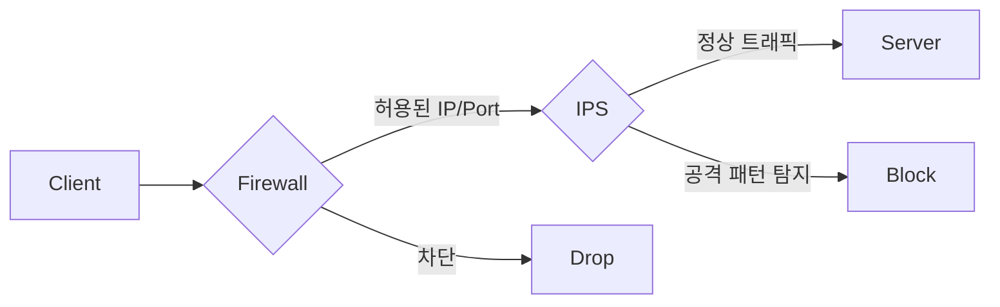
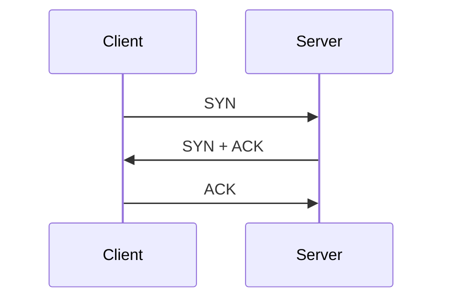

# TCP, UDP, 방화벽, IPS 차이

## 한 줄 요약

TCP와 UDP는 데이터를 전송하는 방식이고, 방화벽과 IPS는 네트워크 트래픽을 통제하고 보호하는 보안 시스템이다.

| 구분 | 분류 | 핵심 역할 |
|---|---|---|
| TCP | 전송 계층 프로토콜 | 데이터를 안정적으로 전달 |
| UDP | 전송 계층 프로토콜 | 데이터를 빠르게 전달 |
| 방화벽 | 보안 장비/보안 기능 | 허용된 트래픽만 통과 |
| IPS | 보안 장비/보안 기능 | 공격성 트래픽 탐지 및 차단 |

## 전체 구조



## TCP

TCP는 Transmission Control Protocol의 약자이며, 데이터를 안정적으로 전달하기 위한 전송 계층 프로토콜이다.

TCP는 연결 지향 방식으로 동작한다. 데이터를 보내기 전에 클라이언트와 서버가 먼저 연결을 맺고, 이후 데이터를 주고받는다.

TCP의 대표적인 특징은 다음과 같다.

* 연결 지향
* 데이터 순서 보장
* 손실된 데이터 재전송
* 흐름 제어
* 혼잡 제어

### TCP 3-way handshake



TCP는 정확성이 중요한 서비스에서 주로 사용된다.

예시:

* HTTP/HTTPS
* SSH
* MySQL/PostgreSQL
* FTP/SFTP
* 이메일 전송

## UDP

UDP는 User Datagram Protocol의 약자이며, 빠른 데이터 전송을 위한 전송 계층 프로토콜이다.

UDP는 TCP와 달리 연결을 맺지 않고 데이터를 바로 보낸다. 따라서 구조가 단순하고 빠르지만, 데이터 도착 여부나 순서를 보장하지 않는다.

UDP의 대표적인 특징은 다음과 같다.

* 비연결형
* 데이터 도착 보장 없음
* 순서 보장 없음
* 자동 재전송 없음
* 낮은 오버헤드

UDP는 실시간성이 중요한 서비스에서 사용된다.

예시:

* 온라인 게임
* 음성 통화
* 영상 스트리밍
* DNS
* WebRTC
* QUIC

## 방화벽

방화벽은 네트워크 트래픽을 검사하여 허용하거나 차단하는 보안 시스템이다.

방화벽은 주로 다음 기준으로 트래픽을 판단한다.

* 출발지 IP
* 목적지 IP
* 포트 번호
* 프로토콜
* 인바운드/아웃바운드 방향

예를 들어 웹 서버에서는 보통 다음처럼 설정한다.

```text
허용: TCP 443  → HTTPS
제한: TCP 22   → SSH는 관리자 IP만 허용
차단: TCP 3306 → MySQL 외부 접근 차단
```

방화벽은 접근 가능 여부를 판단하는 1차 보안 장치라고 볼 수 있다.

## IPS

IPS는 Intrusion Prevention System의 약자이며, 침입 방지 시스템을 의미한다.

IPS는 네트워크 트래픽의 내용을 분석하여 공격 패턴이나 비정상 행위를 탐지하고 차단한다.

방화벽이 “이 IP가 이 포트로 접근해도 되는가?”를 본다면, IPS는 “이 요청 내용이 공격인가?”를 본다.

IPS가 탐지할 수 있는 공격 예시는 다음과 같다.

* SQL Injection
* XSS
* DDoS 패턴
* 포트 스캔
* 악성 페이로드
* 알려진 취약점 공격

## TCP와 UDP 비교

| 구분    | TCP           | UDP           |
| ----- | ------------- | ------------- |
| 연결 방식 | 연결 지향         | 비연결형          |
| 신뢰성   | 높음            | 낮음            |
| 순서 보장 | 보장            | 보장하지 않음       |
| 재전송   | 있음            | 없음            |
| 속도    | 상대적으로 느림      | 빠름            |
| 사용 목적 | 정확한 전송        | 빠른 전송         |
| 사용 예시 | HTTP, SSH, DB | 게임, DNS, VoIP |

## 방화벽과 IPS 비교

| 구분    | 방화벽                   | IPS              |
| ----- | --------------------- | ---------------- |
| 목적    | 접근 통제                 | 공격 탐지 및 차단       |
| 검사 기준 | IP, 포트, 프로토콜          | 패킷 내용, 공격 패턴     |
| 역할    | 들어와도 되는 트래픽인지 판단      | 들어온 트래픽이 공격인지 판단 |
| 한계    | 정상 포트로 들어오는 공격 탐지 어려움 | 오탐 가능성, 성능 비용 발생 |

## 면접 답변

TCP와 UDP는 데이터를 전송하는 방식에 대한 전송 계층 프로토콜입니다. TCP는 연결 지향 방식으로 데이터를 보내기 전에 연결을 맺고, 순서 보장, 손실 시 재전송, 흐름 제어, 혼잡 제어를 통해 신뢰성 있는 통신을 제공합니다. 그래서 HTTP, SSH, 데이터베이스 연결처럼 정확성이 중요한 서비스에서 사용됩니다.

반면 UDP는 비연결형 방식으로 데이터를 바로 전송합니다. 데이터 도착이나 순서를 보장하지 않고 재전송도 기본적으로 제공하지 않지만, 오버헤드가 적고 빠르기 때문에 게임, 음성 통화, 영상 스트리밍, DNS처럼 실시간성이 중요한 서비스에서 사용됩니다.

방화벽과 IPS는 프로토콜이라기보다는 보안 시스템입니다. 방화벽은 IP, 포트, 프로토콜 정보를 기준으로 트래픽을 허용하거나 차단하는 역할을 하고, IPS는 트래픽의 내용을 분석해서 SQL Injection, 포트 스캔, 악성 페이로드 같은 공격 패턴을 탐지하고 차단합니다.

즉, TCP와 UDP는 통신 방식이고, 방화벽과 IPS는 그 통신을 보호하고 통제하는 보안 장치라고 볼 수 있습니다.
